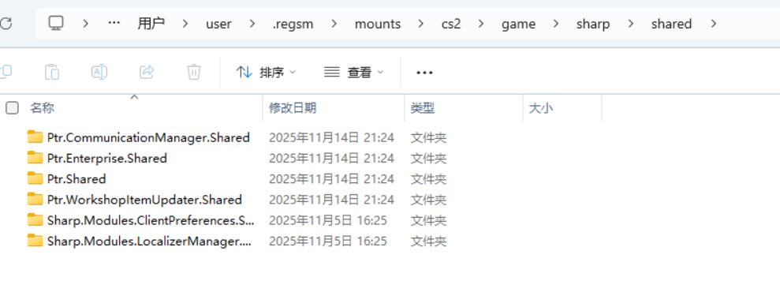

# Installing API

We often have the need to write modules and share some functionality publicly.

`Shared Interface` should be installed in the `{CS2}/game/sharp/shared` folder.

> [!NOTE]
> The loading rules are the same as for modules.

As shown in the figure:

If you need to install APIs, please install them in the location shown in the figure.
